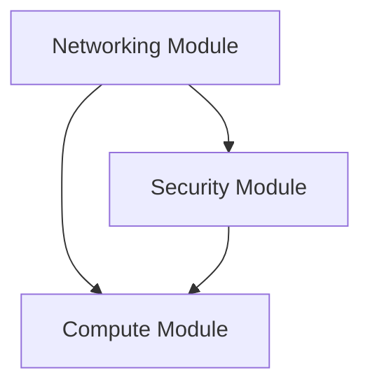

# AWS Infrastructure with Terraform

This repository contains Terraform configurations to deploy a scalable web application infrastructure on AWS using a modular approach.

## Architecture Overview

The infrastructure consists of three main modules:

- **Networking Module**: Creates VPC, subnets, internet gateway, and related networking components
- **Security Module**: Manages security groups for ALB and EC2 instances
- **Compute Module**: Deploys EC2 instances with Auto Scaling Group, Launch Template, and Application Load Balancer

## Project Structure

```
.
├── main.tf                           # Main configuration
├── variables.tf                      # Input variables
├── outputs.tf                        # Output values
├── terraform.tfvars                  # Variable values
├── versions.tf                       # Provider versions
├── README.md                         # This file
└── modules/
    ├── networking/
    │   ├── variables.tf              # Networking module variables
    │   └── outputs.tf                # Networking module outputs
    ├── security/
    │   ├── variables.tf              # Security module variables
    │   └── outputs.tf                # Security module outputs
    └── compute/
        ├── variables.tf              # Compute module variables
        └── outputs.tf                # Compute module outputs
```

## Prerequisites

1. **AWS CLI** configured with appropriate credentials
2. **Terraform** (>= 1.0) installed
3. **AWS Key Pair** created in your target region
4. Appropriate **IAM permissions** to create AWS resources

## Quick Start

### 1. Clone and Configure

```bash
git clone <repository-url>
cd <repository-name>
```

### 2. Update Configuration

Edit `terraform.tfvars` to match your requirements:

```hcl
# Update these values
project_name  = "your-project-name"
key_pair_name = "your-key-pair-name"
aws_region    = "us-west-2"

# Restrict SSH access (replace with your IP)
ssh_cidr_blocks = ["YOUR.IP.ADDRESS.HERE/32"]
```

### 3. Initialize and Deploy

```bash
# Initialize Terraform
terraform init

# Review the plan
terraform plan

# Apply the configuration
terraform apply
```

### 4. Access Your Application

After deployment, the load balancer DNS name will be output. You can access your application at:
```
http://<load-balancer-dns-name>
```

## Configuration Options

### Networking Configuration

| Variable | Description | Default |
|----------|-------------|---------|
| `vpc_cidr` | CIDR block for the VPC | `10.0.0.0/16` |
| `availability_zones_count` | Number of AZs to use | `2` |

### Security Configuration

| Variable | Description | Default |
|----------|-------------|---------|
| `enable_ssh_access` | Enable SSH access to EC2 instances | `false` |
| `ssh_cidr_blocks` | CIDR blocks allowed SSH access | `[]` |

### Compute Configuration

| Variable | Description | Default |
|----------|-------------|---------|
| `instance_type` | EC2 instance type | `t3.micro` |
| `min_size` | Minimum instances in ASG | `1` |
| `max_size` | Maximum instances in ASG | `3` |
| `desired_capacity` | Desired instances in ASG | `2` |

## Module Dependencies



- Security module depends on Networking (VPC ID)
- Compute module depends on both Networking (subnet IDs) and Security (security group IDs)

## Outputs

After successful deployment, you'll have access to:

| Output | Description |
|--------|-------------|
| `vpc_id` | VPC identifier |
| `public_subnet_ids` | Public subnet identifiers |
| `load_balancer_dns_name` | Load balancer DNS name |
| `autoscaling_group_name` | Auto Scaling Group name |

## Remote State (Optional)

To use remote state storage, uncomment and configure the backend in `versions.tf`:

```hcl
backend "s3" {
  bucket         = "your-terraform-state-bucket"
  key            = "terraform.tfstate"
  region         = "us-west-2"
  encrypt        = true
  dynamodb_table = "terraform-state-lock"
}
```

## Security Best Practices

1. **Restrict SSH Access**: Update `ssh_cidr_blocks` to your specific IP range
2. **Use Strong Key Pairs**: Ensure your EC2 key pair uses strong encryption
3. **Enable Encryption**: Consider enabling EBS encryption for instances
4. **Regular Updates**: Keep your AMIs and applications updated
5. **Monitoring**: Implement CloudWatch monitoring and alerting


### Common Issues

**Issue**: `InvalidKeyPair.NotFound`
```
Error: InvalidKeyPair.NotFound: The key pair 'your-key' does not exist
```
**Solution**: Create the key pair in AWS Console or update `key_pair_name` in `terraform.tfvars`

**Issue**: `InvalidVpcID.NotFound`
```
Error: InvalidVpcID.NotFound: The vpc ID 'vpc-xxxxx' does not exist
```
**Solution**: This usually indicates a dependency issue. Run `terraform plan` to check dependencies.

### Useful Commands

```bash
# Validate configuration
terraform validate

# Format code
terraform fmt -recursive

# Show current state
terraform show

# List resources
terraform state list

# Destroy infrastructure
terraform destroy
```

